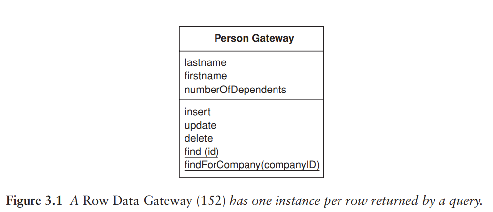
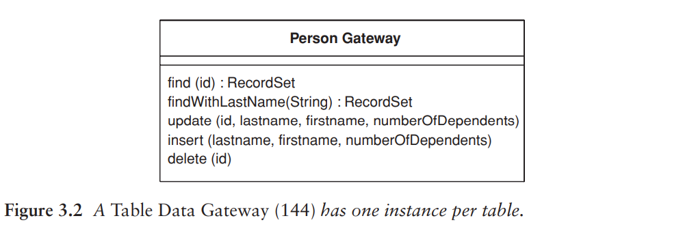
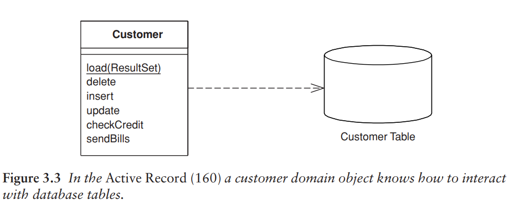
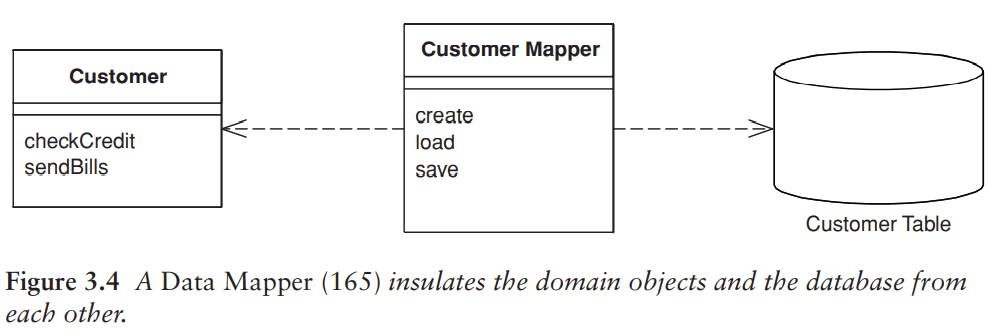

# 對應到關聯式資料庫

## 架構模式

SQL 很廣泛的使用，但有個陷阱：開發人員理解不足，無法建構良好的查詢 (query) 和指令 (command)。所以，一個明智的做法是把 SQL 存取從領域邏輯分離出來，放到單獨的類別。

1. 以資料表為基礎來組織這些類別。每個資料庫資料表都對應一個類別。
2. 這些類別形成資料表之間的 Gateway (Ch. 18)。
3. 應用程式除了這些類別之外不需要知道 SQL 的存在。

使用 Gateway 有兩種主要方式：

- 讓查詢語句傳回的每個資料列都有一個執行個體。Row Data Gateway (Ch. 10) 是以物件導向的方式看待資料的適當方法之一。
- Record Set: 資料列和資料表的一種通用資料結構。使用 Record Set 的話，資料庫中每個資料表只需要對應一個物件。Table Data Gateway (Ch. 10) 提供查詢資料庫的方法，然後回傳 Record Set。

即使開發簡單的應用程式，也傾向使用其中一種閘道模式。

在簡單的應用程式中，Domain Model 是一個與資料非常相似的簡單結構，每一個資料庫的資料表都有一個對應的領域類別。這類領域物件的商業邏輯通常複雜度適中。這種情況下，讓每個物件負責從資料庫中 **載入** 和 **儲存** 是有意義的。這也就是 Active Record (Figure 3.3)。這種情況下，加入 Gateway 提供的 **間接性** 幫助不大。

隨著領域邏輯越來越複雜，Domain Model 也越來越豐富，此時簡單的 Active Record 開始不堪負荷。如果把領域邏輯分解成較小的類別時，**領域類別** 與 **資料表** 的對應開始失敗。關聯式資料庫不處理繼承，所以很難使用策略模式或其他較好的物件導向模式。隨著領域邏輯日益活躍，這時會希望不用存取資料庫就能隨時測試它。這種情況下會推動你使用 **間接性**。Gateway 可以解決一些問題，但它會留下一個與資料庫 schema 耦合的 Domain Model。結果就是會產生一些從 Gateway 欄位到領域物件欄位之間的轉換動作，這種轉換動作會讓領域物件變得複雜。

一個更好的途徑是把 Domain Model 與資料庫完全隔離，讓間接分層完全負責領域物件與資料庫資料表之間的對應關係。Data Mapper (Ch. 10) 負責處理資料庫和 Domain Model 之間所有載入和存取，且兩者都能獨立變化。它是最複雜的資料庫對應架構，但它好處是可以兩個層次之間完全隔離。

作者不建議使用 Gateway 作為 Domain Model 的主要持續性機制。

- 如果領域邏輯非常簡單、且類別與資料表之間的對應十分一致，那麼使用 Active Record 就非常足夠了。
- 如果領域邏輯更複雜，Data Mapper 才是你需要的。

### 持續性機制

這些模式不是完全互斥。大部分討論中，我們主要關心持續性機制。為此，將需要選擇這些模式中的其中一個，而且不希望將它們混在一起，因為這樣會很混亂。即使使用 Data Mapper 作為主要的持續性機制，還是可以使用資料 Gateway 來包裝被視為外部介面的資料表或服務。

對於 view 或 query 來說，「更新」這件事情更加複雜，因為不能直接更新在 view 上面，而是要操作對應的 table。這種情況下，用適當的模式來封裝 view 和 query 並在相同位置實作更新邏輯是一個好方法，可以讓 view 變得簡單又可靠。

這種方式造成的問題是它可能導致不一樣的結果，讓不了解 view 如何形成的開發人員感到驚訝。例如：開發人員可能在兩個不同結構上執行更新，這兩個結構會更新同一個 table，其中第二個會覆蓋第一個更新作業。

即使是最複雜的 Domain Model 也可以簡單持續化。使用物件導向資料庫，就不用擔心對應關係。可以使用由許多互相連結的物件所組成的大型結構，資料庫會決定何時同時存取。也可以使用 transaction，並允許 data store 共享。

物件導向資料庫帶來很多好處。然而，大多數專案都不使用。因為關聯式資料庫是廣為人知且易於理解的產品，技術也成熟，並且很多廠商提供長期支援。

即使不使用物件導向資料庫，但如果有 Domain Model 的話，可以考慮購買 ORM 工具。本書會討論如何建置 Data Mapper 的知識，但這還是很複雜。ORM 廠商花了很多時間解決這些問題，商用 ORM 工具會比任何自己手工完成的可靠許多。
