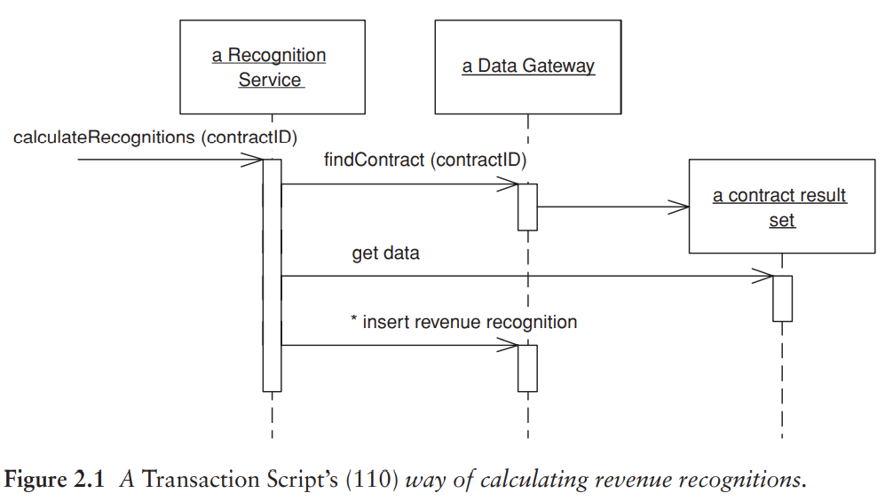
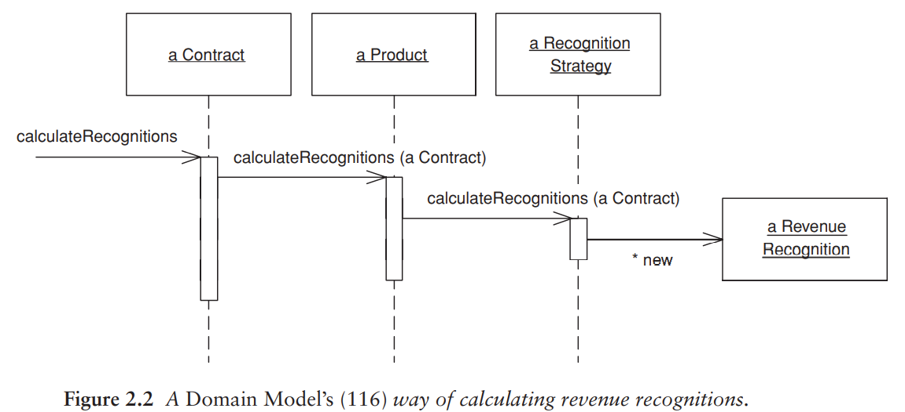
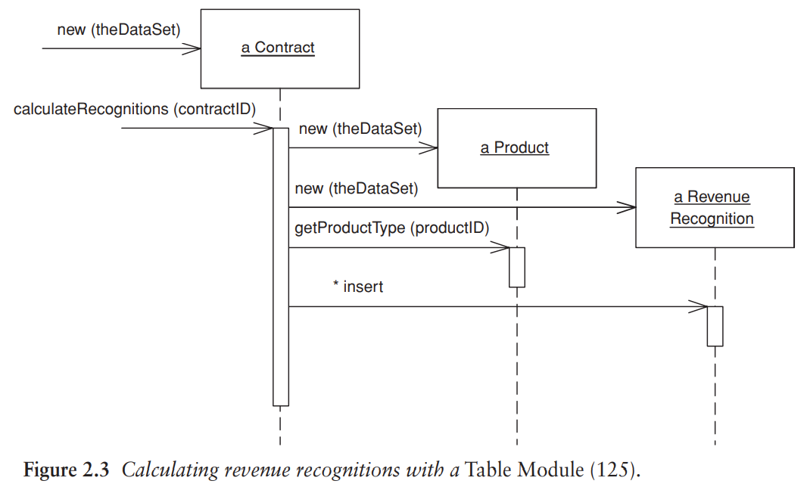
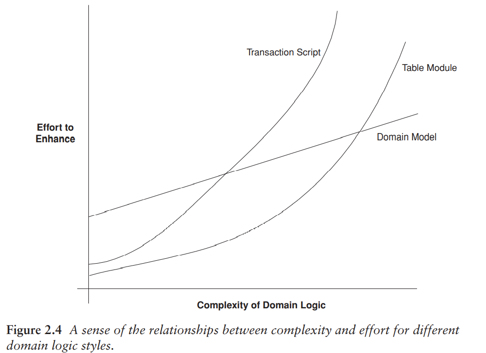

# 組織領域邏輯

組織領域邏輯主要有三種模式：

- Transaction Script
- Domain Model
- Table Module

## Transaction Script

針對使用者想要執行的每一項操作，使其對應一個程序。

優點：

- 大多數開發人員可以理解的簡單程序模型。
- 能使用 Raw Data Gateway 或 Table Data Gateway 與簡單資料來源層配合良好。
- 如何設置交易範圍的方法顯而易見：從開啟交易開始，到關閉交易結束。使用工具很容易在背景作業做到這一點。

缺點：

- 通常多個 Transaction Script 會出現重複的程式碼，因為某些交易會需要做相似的操作。重複的程式碼難以被發現並移除。
- 使得最後應用程式變得錯綜複雜，沒有一個清晰的結構。

## Domain Model

一種圍繞著領域行為與資料的物件模型 (an object model of the domain that incorporates both behavior and data)。在 Domain Model 中，由每一個物件來承擔一部分相關的邏輯，而非由一個程序來處理使用者操作上的所有邏輯。

使用 Domain Model 取代 Transaction Script 是物件導向開發人員的典範轉移的精髓。

以下 Figure 2.1, 2.2 循序圖展示了兩種差別。問題的核心在於，不同種類的產品有不同的演算法來確認一個給定合約的收入。計算方法必須確定合約適用哪一種產品並套用正確的演算法，接著建立收入確認物件 (revenue recognition object) 來獲得計算結果。

Figure 2.1 中，`calculateRecognitions (contractID)` 方法將會完成所有工作；Figure 2.2 中有多個物件，每個都往後轉送部分的行為給另一個物件，直到策略物件建立結果為止。

優點：

- 一旦熟悉 Domain Model，就可以運用現有的技術井然有序的組織複雜邏輯。如果有新的演算法，就加入新的策略物件。如果用 Transaction Script 的話，則需要在許多條件邏輯中加入更多條件。

缺點：

- 如果不熟悉的話會感到困擾，為了尋找行為在何處，必須在多個物件中跳轉。
- Domain Model 越來越豐富時，將它對應到關聯式資料庫就越複雜（通常使用 Data Mapper）。

## Table Module

與 Domain Model 類似，差別在於 Domain Model 對於每個合約都有一個 instance，而 Table Module 只有一個。Table Module 是與 Record Set 一起使用的。

例如 Figure 2.3：

1. Table Module 的用戶端先向資料庫查詢，產生 Record Set。
2. 建立一個合約物件，將 Record Set 作為引數傳遞給它。
3. 用戶端就可以呼叫合約上的操作來執行各種工作。

優點：

- 提供更大幅度的結構化，讓搜尋和移除重複碼變簡單。
- 方便銜接軟體架構中其他部分。

缺點：

- 無法使用許多在 Domain Model 中那些讓組織結構更完善的技術，例如物件導向的設計模式。

## 選擇

- 這三者不互斥。某些邏輯使用 Transaction Script 同時其它邏輯使用 Table Module 配合 Domain Model 也很常見。
- 熟悉 Domain Model 的開發團隊會降低使用此模式的成本。開發團隊經驗越豐富則越傾向使用 Domain Model。
- 如果一開始選擇使用 Transaction Script，可以中途重構成 Domain Model；如果一開始選擇 Domain Model，則不推薦使用 Transaction Script，除非可以有效簡化資料來源層。

## Service Layer

另一種處理領域邏輯的方法，是將領域邏輯再分兩層。獨立出來的 Service Layer 將放置在基礎的 Domain Model 或 Table Module 之上。而只使用 Transaction Script 的領域分層不複雜，不太需要再分一層。展示邏輯透過 Service Layer 來和領域層互動，Service Layer 充當應用程式的 API。

- 提供 API
- 交易控制
- 安全性驗證

Service Layer 該有多少的行為？

- 最小化：使用 Facade pattern。所有實際上的行為都在下層的物件中，而 Service Layer 將外觀的呼叫轉送給較低層級的物件。
    - Service Layer 可以提供一個容易使用的 API，因為它通常圍繞著使用案例 (Use Case) 來組織。
    - Service Layer 可以提供一個進入點，用來加入交易封裝和安全性驗證。
- 將大多數的商業邏輯放入 Service Layer 中的 Transaction Script 中。下層的領域物件變得簡單。
    - 如果下層是 Domain Model，它將會和資料庫對應，就可以使用更簡單的資料來源層。例如 Active Record (Ch. 10)
- Controller-entity style: 在 Transaction Script 放一個交易或使用案例的特定邏輯，通常被稱為 controller 或 service。(和 MVC 的 controller 不同)
    - 這是個常見作法，但作者不喜歡，因為這容易助長重複的程式碼。如果決定使用 Domain Model，那就全力使用它。

作者建議：如果確定要使用，則盡量使用輕量化的 Service Layer。通常假設一開始不需要，當應用程式需要時才導入，而不是當作軟體架構層次使用。
